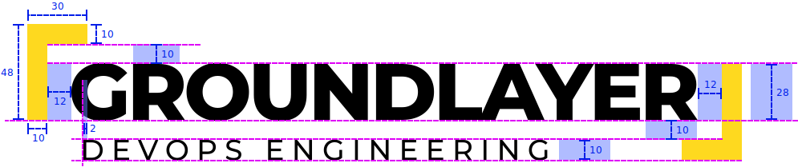
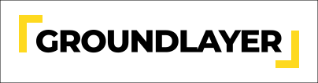
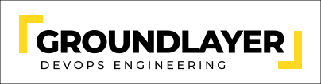
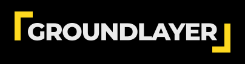
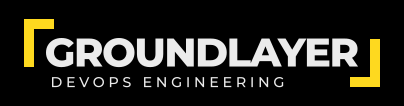
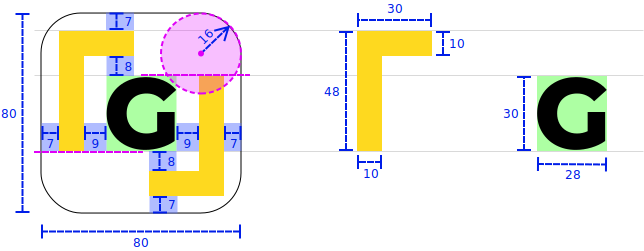
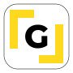

# Logo

Design specifications for the website logo and its variations.

## Usage

### Basics

To use any of the logos, export the corresponding artboards directly from [Sketch](https://www.sketch.com/).

> For example, select the desired artboards and click _Export Selected..._.

All artboards are intended to be exported as SVG files.

### Convert to PNG

To convert an SVG file to a PNG image of a specific size, use [Inkscape](https://inkscape.org/) with the following command:

```bash
inkscape [-w <width>] [-h <height>] input.svg -o output.png
```

In the above command, either the `-w` or `-h` option may be omitted, in which case the unspecified dimension is calculated automatically by maintaining the aspect ratio.

> On macOS, Inkscape can be installed with `brew install --cask inkscape`, which also automatically links the Inkscape CLI.

## Logo specifications

### Horizontal

This is the primary logo used in the website.



| Property                   | Value                |
|:---------------------------|:---------------------|
| Title font                 | Montserrat ExtraBold |
| Title font size            | 40                   |
| ↳ Title cap height         | 28 px                |
| Title character spacing    | -1.5                 |
| Slogan font                | Montserrat Medium    |
| Slogan font size           | 14.29                |
| ↳ Slogan cap height        | 10 px                |
| Slogan character spacing   | 3.7                  |
| Light versions text colour | #000000              |
| Dark versions text colour  | #EBEBEB              |
| Decoration colour          | #FED91F              |

> **Note:** the slogan is optional. Addition or removal of the slogan does not change the positioning of any of the other components.

Previews:

| Version           | Preview                                                                               |
|:------------------|:--------------------------------------------------------------------------------------|
| Light             |                     |
| Light with slogan |  |
| Dark              |                       |
| Dark with slogan  |    |

### Icon

This is a compact form of the logo that can be used as an icon. Currently only used as the favicon for the website.



| Property                        | Value                |
|:--------------------------------|:---------------------|
| Title font                      | Montserrat ExtraBold |
| Title font size                 | 40                   |
| ↳ Title cap height              | 28 px                |
| Light version text colour       | #000000              |
| Light version background colour | #FFFFFF              |
| Dark version text colour        | #EBEBEB              |
| Dark version background colour  | #000000              |
| Decoration colour               | #FED91F              |

Previews:

| Version | Preview                                      |
|:--------|:---------------------------------------------|
| Light   |  |
| Dark    |    |
