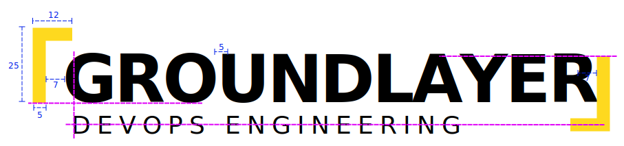
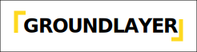
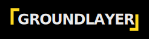
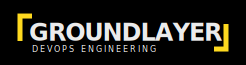
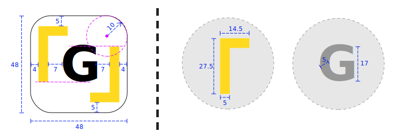
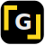

# Logo

## Full Logo

### Specs

| Property                             | Value                |
|:-------------------------------------|:---------------------|
| Title font                           | Montserrat ExtraBold |
| Title font size                      | 24                   |
| Title character spacing              | -0.9                 |
| Slogan font                          | Montserrat Medium    |
| Slogan font size                     | 8                    |
| Slogan character spacing             | 2                    |
| Text colour light background (black) | #000000              |
| Text colour dark background (white)  | #EBEBEB              |
| Accent colour (yellow)               | #FED91F              |

### Versions

| Version                      | Image                                                       |
|:-----------------------------|:------------------------------------------------------------|
| Light background             |                     |
| Light background with slogan |  |
| Dark background              |                       |
| Dark background with slogan  |    |

> **Note:** in the versions with a slogan, the slogan is added without changing the position of any of the other elements.

## Icon

### Specs

| Property                  | Value                |
|:--------------------------|:---------------------|
| Title font                | Montserrat ExtraBold |
| Title font size           | 24                   |
| "Light" text colour       | #000000              |
| "Light" background colour | #FFFFFF              |
| "Dark" text colour        | #EBEBEB              |
| "Dark" background colour  | #000000              |
| Accent colour             | #FED91F              |

### Versions

| Version | Preview                              |
|:--------|:-------------------------------------|
| Light   |  |
| Dark    |    |
